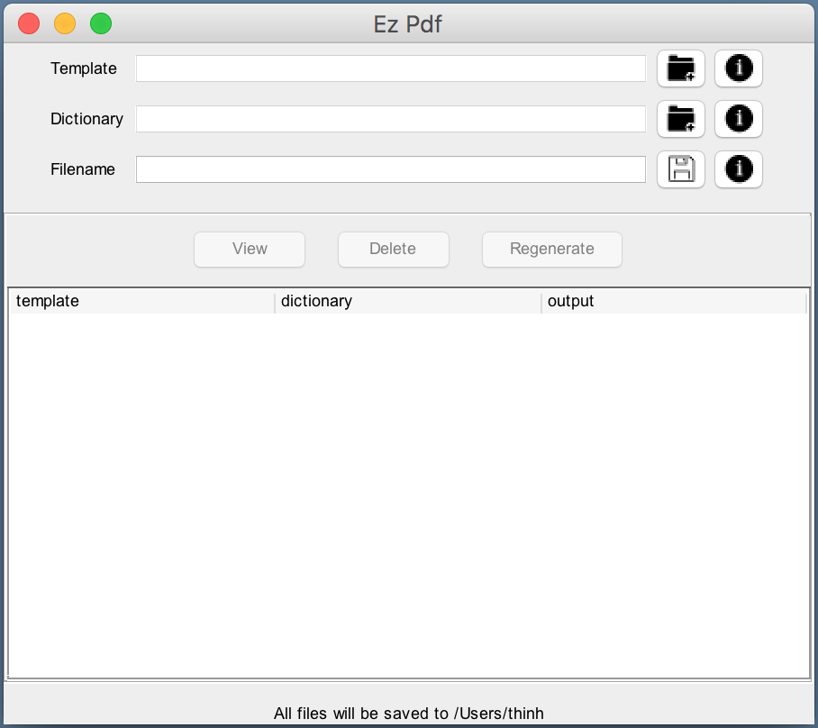

# eztemplate

>I have a document that I manually fill in on a regular basis - print it out, fill in the necessary blanks, and then finally give it to clients. This project facilitates my use-case for automatically generating a PDF document based on a template and a set dictionary.

## Overview
This project comprises of 3 modules that provide a way for the user to generate a PDF document from a template and a dictionary. The modules:

1. eztemplate-core: API level library for template generation.
2. eztemplate-pdf: A PDF implementation for template generation using [iText](http://itextsupport.com/apidocs/itext7/latest/).
3. ezpdf: A simple UI that allows to user to specify a template and a dictionary to generate a translated PDF document.

## ezpdf



Ez Pdf is a simple standalone, thick-client application that runs on the user's local machine. Application data is saved in `$HOME/.ezpdf` which only includes a log file. Prebuilt application artifacts on Dropbox can be found below and support Mac, Windows and Linux.

1. Mac [ezpdf-0.1.dmg](https://www.dropbox.com/s/jts7k3jzfj4l6i2/ezpdf-0.1.dmg?dl=0)
2. Linux/Windows [ezpdf-0.1.tar](https://www.dropbox.com/s/x6wzebfdhp73njl/ezpdf-0.1.tar?dl=0)
3. Linux/Windows [ezpdf-0.1.zip](https://www.dropbox.com/s/cjuyd60ccmab08p/ezpdf-0.1.zip?dl=0)

Sample input files are included with this project.

1. lease.txt - Example template text file.
2. lease.properites - Dictionary that fills in the lease above with empty blank lines - essentially for form for you to manually write in the values.
3. parker.properties - Dictionary that fills in the lease above with values.

Image icons for ezpdf are provided by [xinhstudio](https://www.iconfinder.com/xinhstudio).

## Building
Gradle builds the application and uses the following plugins to build distributable artifacts.

1. [Gradle](https://docs.gradle.org/current/userguide/distribution_plugin.html) `distribution`
2. [Spring](https://docs.spring.io/spring-boot/docs/current/reference/html/build-tool-plugins-gradle-plugin.html) `spring-boot`
3. [crotwell](https://github.com/crotwell) [MacApp Bundle](https://github.com/crotwell/gradle-macappbundle)

```
gradle clean build
```

Navigate to `eztemplate/ezpdf/build/distributions` where there will be the following files for running **ezpdf** in Mac/Unix/Windows environments:

1. `dmg` file to install and run in Mac OSX
2. `tar` file packaged with the Unix and Windows runscripts along with all necessary dependencies
3. `zip` file which contains the same contents as the `tar` file